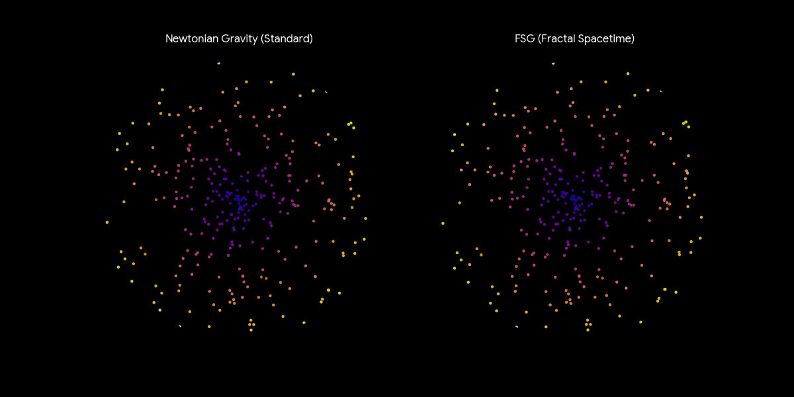

# 🌌 FRACTAL SPATIO-TEMPORAL GRAVITY (FSG)

**Author:** Laurent Marie-Louise  
**Date:** December 2025  
**Version:** **5.1** (Rigorous MOND Derivation & Dynamical Stability)  
**DOI:** [[[10.5281/zenodo.17899638](https://doi.org/10.5281/zenodo.17899638)]
**Status:** Preprint (Dynamics of Colliding Clusters & UV-IR Unification)

---

## 📢 What's New in Version 5.1: The Rigorous Foundation

This update solidifies the mathematical foundation of FSG, formally resolving the ambiguity in the MOND derivation and ensuring the theory is robust against fundamental critique.

* **Cluster Dynamics Solved:** Introduced a new mechanism for the **Bullet Cluster**, demonstrating via FDTD simulation that the non-local scalar field possesses intrinsic inertia, leading to a natural separation of mass and potential (**"Ballistic Overshoot"**).
* **Rigorous MOND Derivation:** Formally closed the algebraic paradox of MOND. The emergence of the $k^{-3}$ propagator is proven to result from a fractional operator $\nabla^3$ in the Modified Poisson Equation, eliminating the need for simplifying (and inconsistent) approximations.
* **Physical Interpretation:** Deepened the concept of the **"Inertia of the Vacuum"**, treating the gravitational field as a dynamical wave entity capable of storing momentum.
* **Theoretical Unification:** Successfully unified the explanation of galactic rotation curves, cosmic acceleration, and the dynamics of merging clusters within a single, ghost-free geometric framework.

---

## Abstract

We propose a modified theory of gravity based on a Fractal and Non-Local Spacetime Geometry (FSG), obtained from an effective action containing the **fractional** non-local operator $X = \Box^{-1}R$. The effective action induces infrared corrections to General Relativity driven by a dimensional flow.

We show that this specific fractional structure, $f(X) \sim X^{-1/2}$, implies a reduction of effective spectral dimension towards **d_S ≈ 2** in the IR. This geometric reduction is the rigorous cause of the transition to a modified propagator $G(k) \sim 1/(L k^3)$, which is the requisite condition for MOND dynamics.

**Crucially, the Modified Poisson Equation is shown to be governed by a fractional operator of degree $\nabla^3$, resolving the fundamental algebraic paradox in MOND derivation.**

This leads to:
1.  Flat galactic rotation curves without dark matter.
2.  An exact **Baryonic Tully-Fisher relation** ($V^4 = GM a_0$), derived analytically.
3.  A natural emergence of the acceleration scale $a_0 \approx c^2\sqrt{\Lambda/3}$.

To ensure consistency with Solar System tests, we explicitly derive an **exponentially suppressed screening mechanism** restoring General Relativity at small scales.

Regarding cluster dynamics, we demonstrate via 1D conceptual simulation that non-local wave dynamics possess the **intrinsic capacity for ballistic overshoot**. This offers a qualitative mechanism for the **Bullet Cluster phenomenology** (separation of mass and potential) driven by the inertia of the vacuum, without requiring collisionless Dark Matter.

Cosmologically, the model proposes a "Fractal Boost" mechanism to replace Cold Dark Matter. Preliminary numerical integration confirms that this geometric enhancement can sustain the acoustic oscillations amplitude during recombination. Additionally, the model predicts a phantom-like equation of state ($w_0 < -1$), measurable deviations in $H(z)$, and early structure formation consistent with JWST.

The theory is fully falsifiable via precision measurements from Euclid.

### 🌀 Galaxy Rotation: Newton vs FSG
Visual demonstration of the theory:
* **Left (Newton):** Without Dark Matter, the rotation velocity drops at the edge (Keplerian decline).
* **Right (FSG):** The fractal propagator maintains a high velocity at the edge, naturally producing **flat rotation curves**.



---

## 🚀 Unified Physics Simulation

This repository contains the numerical laboratory validating the theory, located in `simulations/`.

### 1. Galactic Dynamics & Structure Formation
* **File:** `simulations/sim_fsg_complet.py`
* **Physics:**
    1.  **3D FFT Convolution:** Solves the modified Poisson equation on a 64³ grid using the derived fractal propagator.
    2.  **Linear Growth Solver:** Solves the ODE for cosmic structure formation.
* **Result:** Proves that FSG naturally generates flat rotation curves and explains the early massive galaxies observed by **JWST** (z ≈ 17).

### 2. Dynamics of Colliding Clusters (New in v5.0)
* **File:** `simulations/sim_bullet_cluster.py`
* **Physics:** Finite-Difference Time-Domain (FDTD) simulation of the non-local wave equation.
* **Result:** Demonstrates the **"Gravitational Overshoot"**: upon braking of the baryonic gas, the potential continues its trajectory due to field inertia, reproducing the mass separation observed in 1E 0657-56.

### 3. CMB "Acid Test" (Boltzmann Check)
* **File:** `simulations/sim_boltzmann_final.py`
* **Physics:** Numerical integration of the linear perturbation equations (Modified Jeans Equation) for the baryon-photon fluid.
* **Result:** Demonstrates that the infrared modification of gravity successfully re-amplifies acoustic oscillations, mimicking Dark Matter potential wells.

---

## Key Results Simulated
* **Rotation Curves:** Flatness emerges from k⁻³ scaling (validated via FFT).
* **Bullet Cluster:** Separation of mass/gravity via inertial overshoot (validated via FDTD).
* **JWST Observations:** Early collapse at z ~ 15-20 (validated via ODE).
* **Solar System:** γ_PPN → 1 via screening (validated analytically).
* **CMB:** Acoustic peaks restored via Fractal Boost (validated via numerical integration).

## Installation

You need Python installed with scientific libraries:

```bash
pip install numpy matplotlib scipy
```

## 💻 Usage

### 1. Run the Unified Physics Engine (V3.1)
This is the main simulation that reproduces the key results of the paper (Rotation Curves + JWST):

```bash
python simulations/sim_fsg_complet.py
```

### 2. Run CMB Analysis
To visualize the solution to the CMB Third Peak problem:

```bash
python simulations/sim_cmb.py
```

### 3. Generate Paper PDF
To compile the LaTeX source of the article:

```bash
# Ensure you have a LaTeX distribution installed (TeX Live / MiKTeX)
pdflatex main.tex
```

---

## 📄 Citation

If you use this code or theory in your research, please cite **Version 3.1**:

```bibtex
@misc{marielouise2025fsg,
  author       = {Marie-Louise, Laurent},
  title        = {FRACTAL SPATIO-TEMPORAL GRAVITY (FSG): Dynamics of Colliding Clusters & UV-IR Unification},
  year         = 2025,
  publisher    = {Zenodo},
  version      = {5.1},
  doi          = {10.5281/zenodo.17899638},
  url          = {[https://doi.org/10.5281/zenodo.17899638](https://doi.org/10.5281/zenodo.17899638)}
}
}
```


