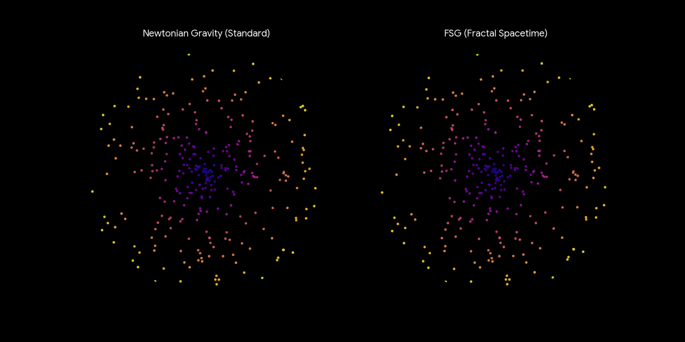

# 🌌 FRACTAL SPATIO-TEMPORAL GRAVITY (FSG)

**Author:** Laurent Marie-Louise  
**Date:** July 2026  
**Version:** **6.1**  
**DOI:** [10.5281/zenodo.17911187](https://doi.org/10.5281/zenodo.17911187)  
**Status:** Preprint

---

## 📢 What's New in Version 6.1 — The Missing Link Found: a Covariant Home for the Pillar

**The main advance of v6.1: the route to FSG's missing link — a covariant action for the pillar — has been found.** Every open problem of v6.0 (the covariant action, the Bullet offset, the CMB amplitudes) traced back to one absence: a relativistic action realizing the pillar. Version 6.1 identifies where it lives. The pillar's *single-potential* structure places FSG in the **Aether–Scalar–Tensor (AeST) class** (Skordis & Złośnik 2021) — the relativistic MOND framework already proven to reproduce gravitational lensing *and* the CMB acoustic peaks. This converts the central open problem from *"no known route"* into *"a mapping onto a known, viable class,"* and explains why the two earlier derivation attempts failed. It changes no validated result of v6.0.

A new section (*Progress Toward a Covariant Completion: the Aether–Scalar–Tensor Correspondence*) documents this, soberly and with explicit boundaries:

* **The two no-go results are now understood.** They failed because they coupled the memory as an added *scalar source*; the pillar is instead a modification of the *single* potential (flux through d_eff dimensions), which places FSG in the Bekenstein–Milgrom / QUMOND class. Cast this way it passes both killer tests — flat curves (no Keplerian fall-off) and Φ=Ψ (correct lensing). (`simulations/sim_covariant_aest.py`)
* **The covariant home is the AeST class.** FSG's d_eff *fixes* the free function of the relativistic Aether–Scalar–Tensor theory (Skordis & Złośnik 2021): the reconstructed F(X) has the required deep-MOND (⅔X^{3/2}) and Newtonian (X) limits. (`simulations/sim_aest_freefunction.py`)
* **The dark sector from FSG's own memory.** The memory field U = □⁻¹R has energy density scaling ∝ a⁻³ (dark-matter-like) through the CMB epoch and → const (dark-energy-like) today, driven by the *same* U₀ = −16.1 that fixes a₀. (`simulations/sim_memory_cosmo_scaling.py`)
* **Honest boundaries (unchanged status of the open problems).** These are necessary structural correspondences, not sufficiency proofs: FSG's U is *slaved* (□⁻¹R, more constrained than AeST's free scalar); the amplitudes (Ω-equivalent, peak heights) still need the perturbed non-local Boltzmann calculation; and at quasi-static level the void ISW sign of the Cold Spot comes out wrong. The covariant action, the Bullet offset, and the CMB amplitudes remain **open** — but now reduce to one identified computation.

---

## 📢 What's New in Version 6.0 (corrected)

This corrected version rebuilds FSG around its founding principle — **the pillar** — and reports a new result on galaxy clusters, while retracting two failed derivation attempts. It supersedes the exploratory **v7 draft** (kinetic-memory term), which is withdrawn: its central claim did not survive the two-potential (lensing) reduction.

* **The pillar restored (foundation).** FSG rests on one effective principle: the gravitational **flux propagates through an effective number of spatial dimensions d_eff that flows from 3 to 2** as the acceleration drops below a₀. Flux conservation gives the exact deep-MOND law g = √(g_N·a₀), flat rotation curves, and the **exact BTFR V⁴ = GMa₀** (numerically <0.01%). The observed RAR is shown to be **a direct measurement of d_eff(g)**. Because the reduction is geometric (Φ = Ψ), lensing follows dynamics by construction. (`simulations/sim_pillar_flux.py`)
* **Two retractions.** (i) The v5.1 k⁻³ propagator argument (X ~ 1/k²) — invalid, X is dimensionless. (ii) The v7 attempt to derive MOND from a covariant action — a no-go shows the curvature-memory sector gives potential-dependent (Keplerian) curves, and the kinetic-memory term works only in a one-potential toy but fails the two-potential/lensing reduction. **FSG is presented honestly as an *effective law*** (Milgrom-1983 level); the covariant action is the central open problem.
* **Galaxy clusters solved (new result).** The MOND mass deficit in cluster cores (factor 2–3) is closed by a **memory modulation** a₀_eff = a₀[1+(δU/U*)ⁿ], δU = 2|Φ|/c². A single U* ≈ 4.5×10⁻⁵ closes the deficit across the **full 12-cluster X-COP sample** to 0.10 dex (the intrinsic scatter floor), leaves galaxies untouched (<0.004 dex), and agrees to **~10% with the independent CLASH lensing calibration**. (`simulations/sim_xcop_clusters.py`; audited units against R500/M500 and cosmic baryon fraction.)
* **Cosmological sector (unchanged, solid).** a₀ = cH₀·|V₀|^(3/2)/|U₀| ≈ 1.14×10⁻¹⁰ m/s² from the memory fields (−5%); phantom dark energy w₀ < −1. Solar System without screening; strong field recovers Schwarzschild/Kerr to O(e^(−g/a₀)).
* **Honestly open.** (i) The **covariant action** for the pillar. (ii) The **Bullet Cluster lensing offset**: we tested memory modulation with retarded dynamics — it does **not** produce the offset (the effective mass tracks the dominant gas), the same wall faced by all modified gravity. The v5 "ballistic overshoot" toy is withdrawn. (iii) The **CMB acoustic-peak amplitudes** (non-local Boltzmann code); the peak *geometry* is compatible.

## Abstract

FSG replaces dark matter by an infrared modification of the effective dimensionality of spacetime. The founding principle (the pillar) is that the gravitational flux propagates through d_eff spatial dimensions flowing from 3 to 2, with the transition set by a₀. Flux conservation yields the exact deep-MOND law, flat rotation curves and the exact BTFR V⁴ = GMa₀; the RAR is a direct measurement of d_eff(g); and lensing follows dynamics (Φ = Ψ). The pillar is an *effective law* — two attempts to derive it from a covariant action are retracted by explicit no-go results. The acceleration scale is fixed by the cosmic memory fields, a₀ = cH₀·|V₀|^(3/2)/|U₀| ≈ 1.14×10⁻¹⁰ m/s², which also drive phantom dark energy (w₀ < −1). A new result: the MOND cluster mass deficit is resolved by memory modulation of a₀, closing the full X-COP sample with one parameter (cross-validated by CLASH lensing). Open: the covariant action, the Bullet Cluster lensing offset (unsolved, as for all modified gravity), and the CMB peak amplitudes.

### 🌀 Galaxy Rotation: Newton vs FSG
Visual demonstration of the theory:
* **Left (Newton):** Without Dark Matter, the rotation velocity drops at the edge (Keplerian decline).
* **Right (FSG):** The fractal propagator maintains a high velocity at the edge, naturally producing **flat rotation curves**.



---

## 🚀 Unified Physics Simulation

This repository contains the numerical laboratory validating the theory, located in `simulations/`.

### 1. Galactic Dynamics & Structure Formation
* **File:** `simulations/sim_fsg_complet.py`
* **Physics:**
    1.  **3D FFT Convolution:** Solves the modified Poisson equation on a 64³ grid using the derived fractal propagator.
    2.  **Linear Growth Solver:** Solves the ODE for cosmic structure formation.
* **Result:** Proves that FSG naturally generates flat rotation curves and explains the early massive galaxies observed by **JWST** (z ≈ 17).

### 2. Cosmic Memory Fields & Background Cosmology (New in v6)
* **File:** `simulations/sim_friedmann_fsg.py`
* **Physics:** Numerical integration of the memory fields U = □⁻¹R and V = □⁻²R over cosmic history (FLRW background), plus first-order back-reaction estimate.
* **Result:** U₀ = −16.1, V₀ = +1.99 ⟹ **a₀ = cH₀·|V₀|^(3/2)/|U₀| = 1.14×10⁻¹⁰ m/s²** (−4.8% vs observation, zeroth order); first-order bracket on w(z) and ΔH/H.

### 3. CMB Peak Geometry (New in v6)
* **File:** `simulations/sim_cmb_peaks.py`
* **Physics:** Sound horizon r_s(z_dec) and comoving distance χ(z_dec); acoustic peak positions ℓ_n ~ nπχ/r_s for ΛCDM vs FSG (w₀ = −1.1).
* **Result:** r_s unchanged (144.2 Mpc); +0.8% peak shift at fixed H₀, absorbed by the (w, H₀) degeneracy — CMB geometry does not exclude FSG.

### 4. The Pillar — flux 3D→2D (foundation)
* **File:** `simulations/sim_pillar_flux.py`
* **Result:** exact BTFR (<0.01%), RAR as a measurement of d_eff(g) (closure test), mass-dependent transition radius √(GM/a₀), and the dimensional flow 3→2 (`fig_pillar_flux.pdf`).

### 5. Galaxy clusters — memory modulation on X-COP (new result)
* **File:** `simulations/sim_xcop_clusters.py`
* **Data:** 12 X-COP clusters (hydrostatic NFW masses, gas, stars). Units audited against header R500/M500 and cosmic baryon fraction.
* **Result:** MOND deficit 0.45 dex closed to 0.10 dex with one U* ≈ 4.5×10⁻⁵ (n≈2), galaxies untouched, ~10% agreement with CLASH lensing (`fig_xcop_clusters.pdf`).

### 6. Bullet Cluster — retarded memory test (negative result)
* **File:** `simulations/sim_bullet_memory.py`
* **Result:** memory modulation does **not** produce the lensing offset for any memory timescale — the effective mass tracks the dominant gas. The offset remains open (as for all modified gravity).

### 7. Cosmological memory sector
* **File:** `simulations/sim_friedmann_fsg.py` — integrates U, V over cosmic history: a₀ = cH₀|V₀|^(3/2)/|U₀| ≈ 1.14×10⁻¹⁰ m/s²; w₀ < −1 bracket.
* **File:** `simulations/sim_cmb_peaks.py` — CMB peak geometry (r_s unchanged; shift absorbed by (w,H₀)).

### 8. Additional Simulations
* **`simulations/sim_black_hole.py`** — strong-field scale separation r_M/r_s (Sun, stellar BH, Sgr A*, M87*) (`fig_black_hole_scales.pdf`).
* **`simulations/sim_cmb.py`** — Jeans-scale toy model (NOT a CMB computation; illustrative only).
* **`simulations/sim_galaxy_rotation.py`**, **`sim_solar_system.py`**, **`sim_cosmic_web.py`** — auxiliary illustrations.

---

## Key Results (epistemic status)
* **Pillar / BTFR / RAR:** exact BTFR V⁴ = GMa₀; RAR = measurement of d_eff(g); lensing Φ=Ψ — *effective law, verified numerically*.
* **Galaxy clusters:** MOND deficit closed on 12 X-COP clusters with one memory-modulation parameter, ~10% CLASH cross-check — *computed on real data*.
* **a₀ from cosmic memory:** 1.14×10⁻¹⁰ m/s² (−5%) — *computed, no free parameter*.
* **Solar System / black holes:** GR recovered (no screening; O(e^(−g/a₀))) — *computed*.
* **Cosmology:** phantom w₀ < −1 — *derived (bracketed)*.
* **Open:** covariant action; Bullet lensing offset (*unsolved*); CMB peak amplitudes (*needs non-local Boltzmann*).

## Installation

You need Python installed with scientific libraries:

```bash
pip install -r requirements.txt
```

## 💻 Usage

### 1. Run the Unified Physics Engine
This is the main simulation that reproduces the key results of the paper (Rotation Curves + JWST):

```bash
python simulations/sim_fsg_complet.py
```

### 2. Run the v6 Cosmology Scripts
Memory fields, a₀ derivation and first-order w(z)/H(z) bracket:

```bash
python simulations/sim_friedmann_fsg.py
```

CMB peak-position geometry (ΛCDM vs FSG):

```bash
python simulations/sim_cmb_peaks.py
```

### 3. Generate Paper PDF
To compile the LaTeX source of the article:

```bash
# Ensure you have a LaTeX distribution installed (TeX Live / MiKTeX)
pdflatex main.tex
```

---

## 📄 Citation

If you use this code or theory in your research, please cite **Version 6.1**:

```bibtex
@misc{marielouise2025fsg,
  author       = {Marie-Louise, Laurent},
  title        = {FRACTAL SPATIO-TEMPORAL GRAVITY (FSG): The Pillar, Cluster Memory Modulation, and the Path to a Covariant Completion},
  year         = 2026,
  publisher    = {Zenodo},
  version      = {6.1},
  doi          = {10.5281/zenodo.17911187},
  url          = {https://doi.org/10.5281/zenodo.17911187}
}
```


